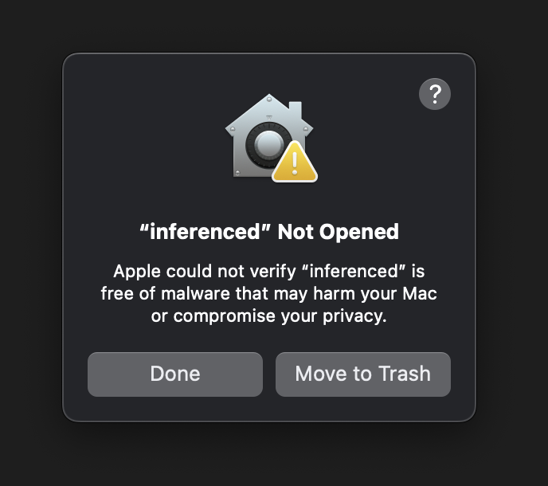
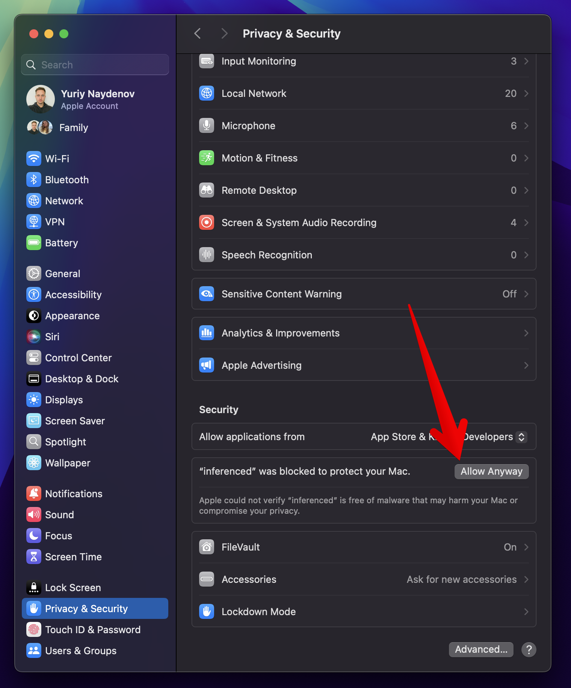
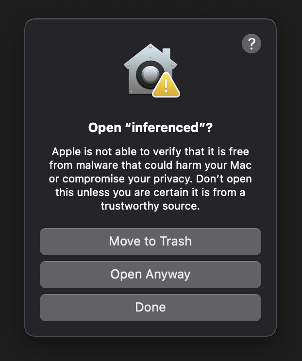

# 🔑 Генерация локального ключа для Gonka (macOS, Apple Silicon)

## 1. Скачать бинарник
Скачай архив:
```
https://github.com/gonka-ai/gonka/releases/download/release%2Fv0.2.3/inferenced-darwin-arm64.zip
```
Распакуй его — появится файл `inferenced`.

---

## 2. Разрешить запуск

Открой **Terminal** и перейди в папку, где лежит файл:
```bash
cd ~/Downloads
```
Запусти файл:
```bash
./inferenced
```

После первой попытки запуска появится предупреждение, что приложение *«inferenced» не может быть открыто*.  
Это нормально — нажми **Done**.



Открой:
> **Системные настройки → Конфиденциальность и безопасность**
(System Settings → Privacy & Security)

Прокрути вниз до блока с надписью:  
> “inferenced” был заблокирован для защиты вашего Mac.

Нажми **Разрешить всё равно (Allow Anyway)**.



## 3. Сгенерировать ключ

Теперь можно создать ключ:
```bash
./inferenced keys add gonka-account-key-cluster1 --keyring-backend file --home ./gonka-keys-cluster1
```

macOS покажет ещё одно окно — нажми **Open Anyway (Открыть всё равно)**.  
После этого бинарник будет считаться доверенным и запускаться без ограничений.



После выполнения команда создаст папку `gonka-keys-cluster1` с ключами.

---

## 5. Пример вывода при успешном создании ключа

После выполнения команды генерации ключа ты увидишь в терминале примерно такой вывод:

```bash
./inferenced keys add gonka-account-key-cluster1 --keyring-backend file --home ./gonka-keys-cluster1
Enter keyring passphrase (attempt 1/3):
Re-enter keyring passphrase:

- address: gonka1w4t3gz76r96kk2d78luumkvyhgdkevkewy8qun
  name: gonka-account-key-cluster1
  pubkey: '{"@type":"/cosmos.crypto.secp256k1.PubKey","key":"AlZwl37etxe8EldJsCWJazIYikiSkVoMPPleCoLjrfzK"}'
  type: local


**Important** write this mnemonic phrase in a safe place.
It is the only way to recover your account if you ever forget your password.

trim silly skate nuclear catch forest rebel web link spoon stove fruit kiss borrow young denial youth then pistol gather noodle shop car lizard
```

Внизу напечатана **мнeмоническая фраза (seed phrase)** — это единственный способ восстановить аккаунт:
```
<ЗАПИШИ ЕЕ В БЕЗОПАСНОЕ МЕСТО, НЕ ПУБЛИКУЙ>
```

---
